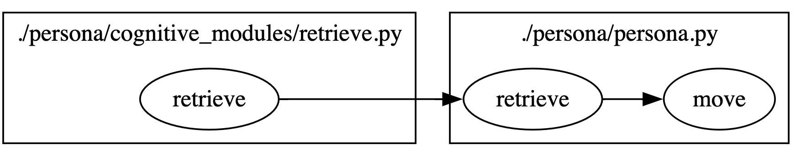
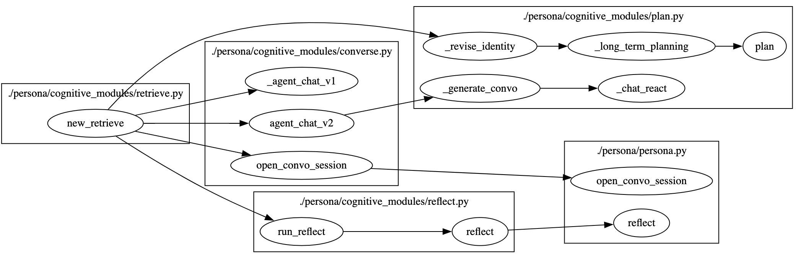
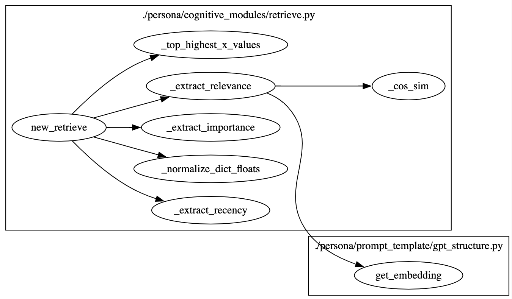

# 脚本功能概述

该脚本定义了生成型代理（generative agents）的 "Retrieve" 模块，用于从代理的记忆中检索与当前感知到的事件相关的记忆和思考。通过计算事件和思考的相似性和重要性，帮助代理在规划时考虑相关的上下文信息。

## 1. 核心类和方法

## 3. 总结

`retrieve.py` 脚本定义了生成型代理的检索模块，通过感知代理周围的事件，检索与这些事件相关的记忆和思考。它包括计算事件和思考的相似性、重要性和相关性的方法，帮助代理在规划时考虑相关的上下文信息。这种检索能力使得代理能够在虚拟世界中更加智能地做出决策和行动。
