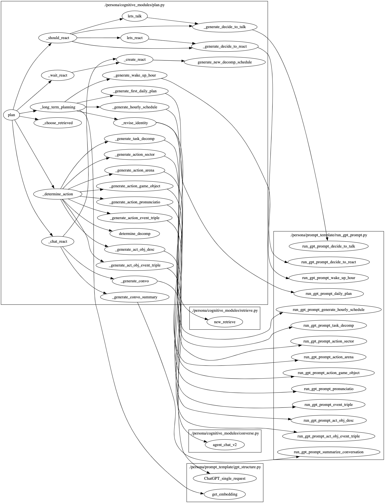

# Plan 模块

## 脚本功能概述

`plan.py` 脚本定义了生成型代理（generative agents）的 "Plan" 模块。该模块负责生成代理的日常计划，包括长短期计划，反应计划，以及与其他代理的互动计划。通过与 GPT-3 模型交互生成代理的每日活动计划，并基于代理的感知和检索到的信息进行相应的反应。

## 1. 核心类和方法

`plan` 函数是生成型代理的规划模块，用于根据感知和记忆信息生成代理角色的日常计划和短期行动计划。以下是函数的详细步骤和调用顺序：

### 主要步骤
1. **长远规划 (Long-Term Planning)**
    - 如果是新的一天，调用 `_long_term_planning` 生成代理角色的每日计划。

2. **确定行动 (Determine Action)**
    - 如果当前行动已经完成，调用 `_determine_action` 生成代理角色的下一个行动。

3. **处理感知事件 (Handle Perceived Events)**
    - 从检索到的记忆中选择一个事件进行关注，并决定是否需要对该事件进行反应。

4. **聊天相关状态清理 (Chat-Related State Cleanup)**
    - 清理聊天相关的状态，确保代理角色不会无限循环地进行对话。

### 函数调用顺序
1. **plan**
    - 调用 `_long_term_planning` 生成长期计划
      - **_generate_wake_up_hour**: 生成角色的起床时间
      - **_generate_first_daily_plan**: 生成角色的第一天的日常计划
      - **_revise_identity**: 修正角色的身份
      - **_generate_hourly_schedule**: 生成每小时的计划

    - 调用 `_determine_action` 生成短期行动
      - **_determine_decomp**: 确定是否需要分解任务
      - **_generate_task_decomp**: 任务分解
      - **_generate_action_sector**: 生成行动区域
      - **_generate_action_arena**: 生成行动竞技场
      - **_generate_action_game_object**: 生成行动的游戏对象
      - **_generate_action_pronunciatio**: 生成行动的描述
      - **_generate_action_event_triple**: 生成行动事件三元组
      - **_generate_act_obj_desc**: 生成对象描述
      - **_generate_act_obj_event_triple**: 生成对象事件三元组

    - 调用 `_choose_retrieved` 选择检索到的事件

    - 调用 `_should_react` 决定是否需要反应
      - **_lets_talk / _generate_decide_to_talk**: 决定是否进行对话
      - **_lets_react / _generate_decide_to_react**: 决定是否进行反应

    - 如果需要对话，调用 `_chat_react` 生成对话
      - **_generate_convo**: 生成对话
      - **_generate_convo_summary**: 生成对话总结
      - **_create_react**: 创建反应
        - **_generate_new_decomp_schedule**: 生成新的分解计划

    - 如果需要等待，调用 `_wait_react` 进行等待
      - **_create_react**: 创建反应

| 函数名                           | 描述                                                         | 输入参数                                                     | 输出                                           |
| -------------------------------- | ------------------------------------------------------------ | ------------------------------------------------------------ | ---------------------------------------------- |
| `_generate_wake_up_hour`         | 生成角色的起床时间                                           | `persona`                                                    | 一个整数，表示角色的起床时间                   |
| `_generate_first_daily_plan`     | 生成角色的每日计划，返回当天的行动列表                       | `persona` ， `wake_up_hour`                             | 一份每日行动列表                               |
| `_generate_hourly_schedule`      | 根据每日计划生成每小时的安排                                 | `persona` ， `wake_up_hour`                             | 一个活动和其持续时间（分钟）列表               |
| `_generate_task_decomp`          | 分解给定的任务                                               | `persona` ， `task`  `duration` (整数，任务持续时间) | 一个包含分解任务描述及其持续时间的列表         |
| `_generate_action_sector`        | 生成行动的区域                                               | `act_desp` (字符串，行动描述)， `persona` ， `maze` (Maze 类实例) | 一个字符串，表示行动的区域                     |
| `_generate_action_arena`         | 生成行动的竞技场                                             | `act_desp` (字符串，行动描述)， `persona` ， `maze` (Maze 类实例)， `act_world` (字符串)， `act_sector` (字符串) | 一个字符串，表示行动的竞技场                   |
| `_generate_action_game_object`   | 生成行动的游戏对象                                           | `act_desp` (字符串，行动描述)， `act_address` (字符串，行动地址)， `persona` ， `maze` (Maze 类实例) | 一个字符串，表示行动的游戏对象                 |
| `_generate_action_pronunciatio`  | 生成行动的表情描述                                           | `act_desp` (字符串，行动描述)， `persona`               | 一个字符串，表示行动的表情描述                 |
| `_generate_action_event_triple`  | 生成行动的事件三元组                                         | `act_desp` (字符串，行动描述)， `persona`               | 一个字符串，表示行动的事件三元组               |
| `_generate_act_obj_desc`         | 生成行动对象的描述                                           | `act_game_object` (字符串)， `act_desp` (字符串)， `persona` | 一个字符串，表示行动对象的描述                 |
| `_generate_act_obj_event_triple` | 生成行动对象的事件三元组                                     | `act_game_object` (字符串)， `act_obj_desc` (字符串)， `persona` | 一个字符串，表示行动对象的事件三元组           |
| `_generate_convo`                | 生成对话                                                     | `maze` (Maze 类实例)， `init_persona` ， `target_persona` | 对话内容和对话长度                             |
| `_generate_convo_summary`        | 生成对话总结                                                 | `persona` ， `convo` (对话内容)                         | 一个字符串，表示对话总结                       |
| `_generate_decide_to_talk`       | 决定是否进行对话                                             | `init_persona` ， `target_persona` ， `retrieved` (字典) | 一个布尔值，表示是否进行对话                   |
| `_generate_decide_to_react`      | 决定是否做出反应                                             | `init_persona` ， `target_persona` ， `retrieved` (字典) | 一个字符串，表示反应模式                       |
| `generate_new_decomp_schedule`   | 生成新的分解日程                                             | `persona` ， `inserted_act` (字符串)， `inserted_act_dur` (整数)， `start_hour` (整数)， `end_hour` (整数) | 一个新的日程列表                               |
| `_revise_identity`               | 修改角色的身份信息                                           | `persona`                                                    | 无                                             |
| `_long_term_planning`            | 制定角色的长期计划，如果是新的一天，则生成起床时间和小时计划 | `persona` ， `new_day` (布尔值或字符串)                 | 无                                             |
| `_determine_action`              | 创建角色的下一个行动序列，并设置所有相关的行动变量           | `persona` ， `maze` (Maze 类实例)                       | 无                                             |
| `_choose_retrieved`              | 从检索到的记忆中选择一个事件以进行反应                       | `persona` ， `retrieved` (字典)                         | 一个字典，表示选择的事件                       |
| `_should_react`                  | 确定角色在给定的检索值下应如何反应                           | `persona` ， `retrieved` (字典)， `personas` (字典) | 一个字符串，表示反应模式，或者布尔值表示不反应 |
| `_create_react`                  | 创建新的反应并添加到角色的行动队列中                         | `persona` ， `inserted_act` (字符串)， `inserted_act_dur` (整数)， `act_address` (字符串)， `act_event` (元组)， `chatting_with` (字符串)， `chat` (对话内容)， `chatting_with_buffer` (字典)， `chatting_end_time` (时间)， `act_pronunciatio` (字符串)， `act_obj_description` (字符串)， `act_obj_pronunciatio` (字符串)， `act_obj_event` (元组)， `act_start_time` (时间) | 无                                             |
| `_chat_react`                    | 处理聊天反应，并调用之前定义的函数生成对话和添加反应         | `maze` (Maze 类实例)， `persona` ， `focused_event` (字典)， `reaction_mode` (字符串)， `personas` (字典) | 无                                             |
| `_wait_react`                    | 处理等待反应，并调用之前定义的函数生成等待的反应             | `persona` ， `reaction_mode` (字符串)                   | 无                                             |
| `plan`                           | 主要的认知函数，用于根据检索到的记忆和感知、迷宫以及初始状态来进行长期和短期的计划 | `persona` ， `maze` (Maze 类实例)， `personas` (字典)， `new_day` (布尔值或字符串)， `retrieved` (字典) | 一个字符串，表示目标行动地址                   |

## 4. 总结

`plan.py` 脚本定义了生成型代理的计划模块，通过生成每日活动计划和反应计划，使代理能够在虚拟世界中智能地进行长短期决策和行动。该模块与 GPT-3 模型交互生成计划，并根据代理的感知和检索信息调整计划，从而提升代理的智能性和适应性。

