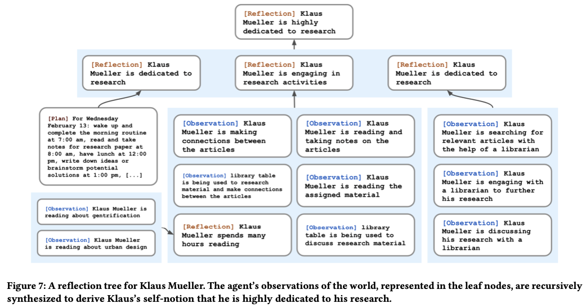
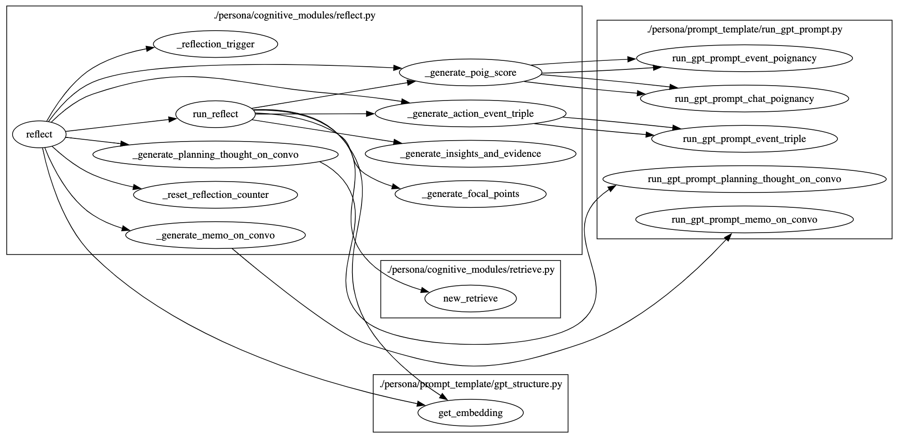

# 脚本功能概述

该脚本定义了生成型代理（generative agents）的 "Reflect" 模块，用于代理进行反思。反思模块生成焦点点（focal points），检索相关记忆，生成新的思考和洞见，并将这些信息保存到代理的记忆中，帮助代理在未来的决策中参考这些反思。

## 背景

### Challenge

当只有原始的观察记忆时，很难进行概括或推断。

考虑这样一个场景:

- 用户问克劳斯·穆勒:“如果你必须在你认识的人中选择一个人共度一小时，你会选择谁?”
  - 由于只能观察记忆，代理只需选择和克劳斯在一起的人交往最频繁的是他大学宿舍的邻居沃尔夫冈。
  - 不幸的是，沃尔夫冈和克劳斯只是偶尔见面，并没有**深入的互动**。

### Method: 反思记忆与生成机制

引入了第二种类型的内存，我们称之为**反思**。反思是由主体产生的**更高层次、更抽象的思想**。

**反思的特点**

- **反思是一种记忆**，因此当检索发生时，它们与其他观察结果一起包含。
- **反思是周期性产生的**；在我们的实现中，当代理感知到的**最新事件的重要性得分总和超过某个阈值**时，我们生成反思。
- 在实践中，我们的代理人**每天大约反思两到三次**。

**反思的生成过程**

1. **确定反思内容** / _generate_focal_points
   
   - 智能体根据最近的经历提出问题。我们用智能体记忆流中**最近的100条记录查询大型语言模型**。
   
   - 示例记录包括：“克劳斯·穆勒正在阅读一本关于中产阶级化的书”，“克劳斯·穆勒正在与图书管理员谈论他的研究项目”，“图书馆的桌子目前无人使用”。

   - 提示语言模型：“**仅根据上述信息，我们可以回答关于语句中主题的3个最突出的==高级问题==是什么**?”
   
   - 模型的反应产生候选问题，例如：
   
     - 克劳斯·穆勒对什么话题感兴趣？
   
     - 克劳斯和马丽亚之间的关系是什么？
   
       
   
2. **检索相关记忆**
   
   - 使用生成的问题作为检索的查询（注意：用到了上面的记忆流检索功能），并收集每个问题的相关记忆（包括其他反思）。
   
3. **提取见解** / generate_insights_and_evidence
   
   - 提示 LLM 提取见解，并引用作为见解证据的特定记录。
   
   - 生成诸如“克劳斯·穆勒致力于他对中产阶级化的研究的陈述（因为1,2,8,15）”的反思。
   
   - 解析语句并将其作为反思存储在内存流中，包括指向引用的内存对象的指针。
   
     

**反思的层次结构**

- **反思树**：反思明确地允许行为人不仅对自己的观察进行反思，而且对其他的反思进行更深层次的反思。树的叶子节点代表基本观察，而非叶子节点代表更抽象和更高层次的思想。
- 例如，上面关于克劳斯·穆勒的第二个陈述是克劳斯之前的反思，而不是来自他的环境的观察。

通过这种机制，智能体能够生成一系列连贯且层次化的反思，从而更好地理解和处理自身的记忆和观察。

## 1. 核心类和方法

## 3. 总结

`reflect.py` 脚本定义了生成型代理的反思模块，通过生成焦点点，检索相关记忆，生成新的思考和洞见，并将这些信息保存到代理的记忆中。该模块帮助代理在未来的决策中参考这些反思，使其能够在虚拟世界中更加智能地做出决策和行动。这个模块在代理的自我改进和长期规划中起着关键作用。
