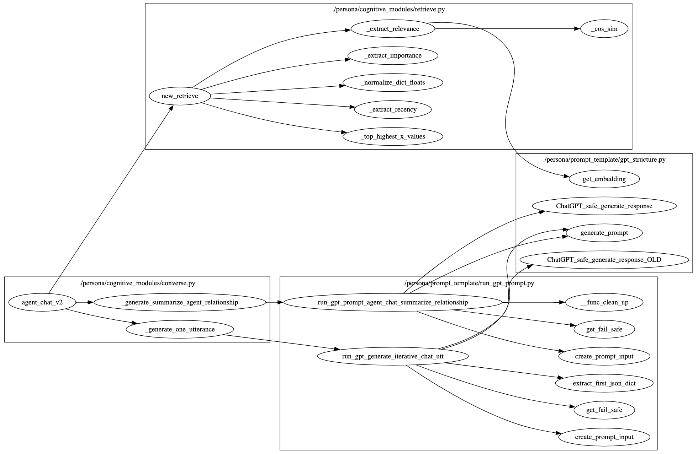
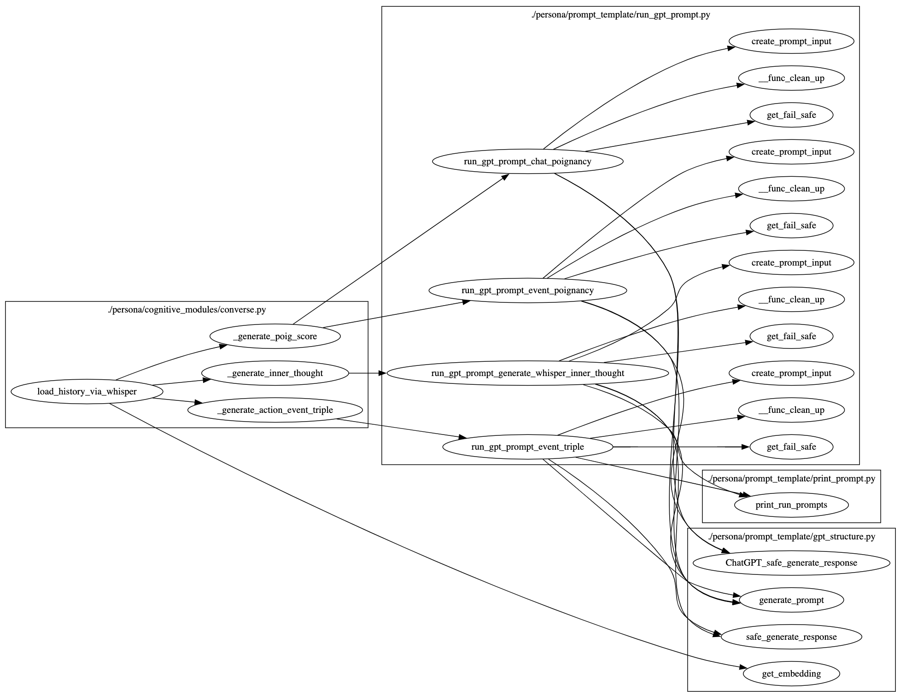
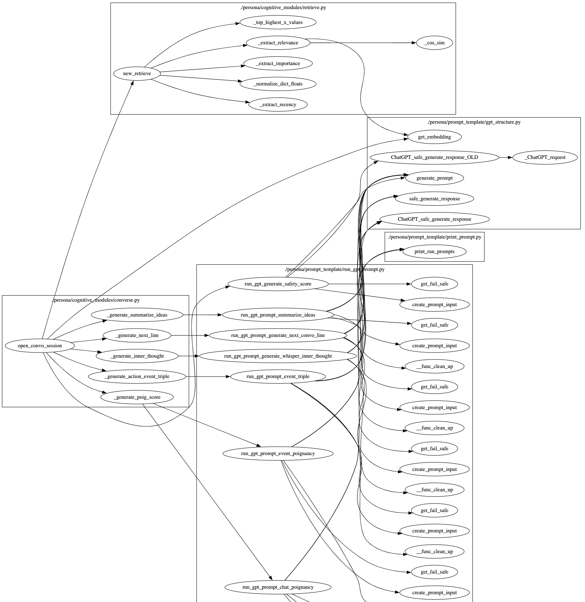

# Converse 模块

## 脚本功能概述

`converse.py` 脚本定义了生成型代理（generative agents）的 "Converse" 模块。该模块负责生成代理之间的对话内容，基于代理的记忆和当前情景生成合理的对话内容。

## 1. 核心类和方法







### 1.1 生成对话相关的方法

#### 1.1.1 生成代理对话总结 `generate_agent_chat_summarize_ideas`

```python
def generate_agent_chat_summarize_ideas(
    init_persona, target_persona, retrieved, curr_context
):
    """
    生成代理对话总结。

    输入：
      init_persona: 初始代理实例。
      target_persona: 目标代理实例。
      retrieved: 检索到的信息。
      curr_context: 当前上下文。

    输出：
      对话总结。
    """
```

- **功能**：生成代理对话总结。
- **输入参数**：
  - `init_persona`：初始代理实例。
  - `target_persona`：目标代理实例。
  - `retrieved`：检索到的信息。
  - `curr_context`：当前上下文。
- **输出**：返回对话总结。

#### 1.1.2 生成关系总结 `generate_summarize_agent_relationship`

```python
def generate_summarize_agent_relationship(init_persona, target_persona, retrieved):
    """
    生成代理关系总结。

    输入：
      init_persona: 初始代理实例。
      target_persona: 目标代理实例。
      retrieved: 检索到的信息。

    输出：
      关系总结。
    """
```

- **功能**：生成代理之间的关系总结。
- **输入参数**：
  - `init_persona`：初始代理实例。
  - `target_persona`：目标代理实例。
  - `retrieved`：检索到的信息。
- **输出**：返回关系总结。

#### 1.1.3 生成代理对话 `generate_agent_chat`

```python
def generate_agent_chat(
    maze, init_persona, target_persona, curr_context, init_summ_idea, target_summ_idea
):
    """
    生成代理对话。

    输入：
      maze: 当前迷宫实例。
      init_persona: 初始代理实例。
      target_persona: 目标代理实例。
      curr_context: 当前上下文。
      init_summ_idea: 初始代理总结。
      target_summ_idea: 目标代理总结。

    输出：
      代理对话。
    """
```

- **功能**：生成代理之间的对话。
- **输入参数**：
  - `maze`：当前迷宫实例。
  - `init_persona`：初始代理实例。
  - `target_persona`：目标代理实例。
  - `curr_context`：当前上下文。
  - `init_summ_idea`：初始代理总结。
  - `target_summ_idea`：目标代理总结。
- **输出**：返回代理对话。

### 1.2 对话模块方法

#### 1.2.1 生成单句对话 `generate_one_utterance`

```python
def generate_one_utterance(maze, init_persona, target_persona, retrieved, curr_chat):
    """
    生成单句对话。

    输入：
      maze: 当前迷宫实例。
      init_persona: 初始代理实例。
      target_persona: 目标代理实例。
      retrieved: 检索到的信息。
      curr_chat: 当前对话内容。

    输出：
      单句对话内容和是否结束对话的标志。
    """
```

- **功能**：生成单句对话。
- **输入参数**：
  - `maze`：当前迷宫实例。
  - `init_persona`：初始代理实例。
  - `target_persona`：目标代理实例。
  - `retrieved`：检索到的信息。
  - `curr_chat`：当前对话内容。
- **输出**：返回单句对话内容和是否结束对话的标志。

#### 1.2.2 生成对话总结 `generate_summarize_ideas`

```python
def generate_summarize_ideas(persona, nodes, question):
    """
    生成对话总结。

    输入：
      persona: 代理实例。
      nodes: 节点列表。
      question: 问题。

    输出：
      对话总结。
    """
```

- **功能**：生成对话总结。
- **输入参数**：
  - `persona`：代理实例。
  - `nodes`：节点列表。
  - `question`：问题。
- **输出**：返回对话总结。

#### 1.2.3 生成下句对话 `generate_next_line`

```python
def generate_next_line(persona, interlocutor_desc, curr_convo, summarized_idea):
    """
    生成下一句对话内容。

    输入：
      persona: 代理实例。
      interlocutor_desc: 对话者描述。
      curr_convo: 当前对话内容。
      summarized_idea: 总结想法。

    输出：
      下一句对话内容。
    """
```

- **功能**：生成下一句对话内容。
- **输入参数**：
  - `persona`：代理实例。
  - `interlocutor_desc`：对话者描述。
  - `curr_convo`：当前对话内容。
  - `summarized_idea`：总结想法。
- **输出**：返回下一句对话内容。

#### 1.2.4 生成内心独白 `generate_inner_thought`

```python
def generate_inner_thought(persona, whisper):
    """
    生成代理的内心独白。

    输入：
      persona: 代理实例。
      whisper: 内心独白的提示。

    输出：
      内心独白。
    """
```

- **功能**：生成代理的内心独白。
- **输入参数**：
  - `persona`：代理实例。
  - `whisper`：内心独白的提示。
- **输出**：返回内心独白。

### 1.3 对话历史加载方法

#### 1.3.1 通过内心独白加载历史 `load_history_via_whisper`

```python
def load_history_via_whisper(personas, whispers):
    """
    通过内心独白加载对话历史。

    输入：
      personas: 代理字典。
      whispers: 内心独白列表。

    输出：
      None
    """
```

- **功能**：通过内心独白加载对话历史。
- **输入参数**：
  - `personas`：代理字典。
  - `whispers`：内心独白列表。

### 1.4 打开对话会话 `open_convo_session`

```python
def open_convo_session(persona, convo_mode):
    """
    打开对话会话。

    输入：
      persona: 代理实例。
      convo_mode: 对话模式（分析或耳语）。

    输出：
      None
    """
```

- **功能**：打开对话会话。
- **输入参数**：
  - `persona`：代理实例。
  - `convo_mode`：对话模式（分析或耳语）。

## 2. 示例代码

```python
if __name__ == "__main__":
    from persona import Persona
    from maze import Maze

    persona1 = Persona("example_persona_1")
    persona2 = Persona("example_persona_2")
    maze = Maze()

    convo_mode = "analysis"  # 可选择 "analysis" 或 "whisper"

    open_convo_session(persona1, convo_mode)
```

## 3. 总结

`converse.py` 脚本定义了生成型代理的对话模块，通过生成对话内容和内心独白，使代理能够在虚拟世界中进行逼真的对话交互。该模块基于代理的记忆和当前情景生成合理的对话内容，从而提升代理的智能性和互动性。
