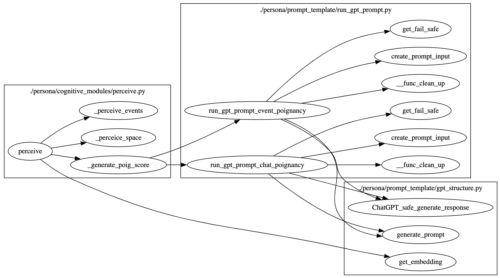

# 脚本功能概述

该脚本定义了生成型代理（generative agents）的 "Perceive" 模块，用于代理感知周围环境和事件，并将其存储到记忆中，帮助代理在虚拟世界中做出行为决策。

## 1. 核心类和方法



### 1.1 全局方法

#### 1.1.1 生成重要性评分方法 `generate_poig_score`

```python
def generate_poig_score(persona, event_type, description):
    if "is idle" in description:
        return 1

    if event_type == "event":
        return run_gpt_prompt_event_poignancy(persona, description)[0]
    elif event_type == "chat":
        return run_gpt_prompt_chat_poignancy(persona, persona.scratch.act_description)[0]
```
- **功能**：生成事件或聊天的情感评分（poignancy score），用于衡量事件或聊天的重要性。
- **输入参数**：
  - `persona`：当前代理实例。
  - `event_type`：事件类型（"event" 或 "chat"）。
  - `description`：事件描述。
- **输出**：返回情感评分。

#### 1.1.2 感知方法 `perceive`

```python
def perceive(persona, maze):
    """
    感知代理周围的事件并将其保存到记忆中，包括事件和空间。

    输入：
      persona: 当前代理的实例。
      maze: 当前代理所在迷宫的实例。
    输出：
      ret_events: 一个包含感知到的新事件的 <ConceptNode> 列表。
    """
```
- **功能**：感知代理周围的事件和空间，并将新事件保存到记忆中。
- **输入参数**：
  - `persona`：当前代理实例。
  - `maze`：当前迷宫实例。
- **输出**：返回感知到的新事件的 `ConceptNode` 列表。
- **详细说明**：
  - **感知空间**：获取代理视野范围内的附近格子，并存储在代理的空间记忆树中。
  - **感知事件**：感知当前竞技场中的事件，根据距离排序并选择最近的事件。将新事件保存到代理的记忆中，并生成相应的 `ConceptNode` 实例。

### 1.2 方法实现

#### 1.2.1 感知空间

```python
# 获取附近的格子
nearby_tiles = maze.get_nearby_tiles(persona.scratch.curr_tile, persona.scratch.vision_r)

# 存储感知到的空间
for i in nearby_tiles:
    i = maze.access_tile(i)
    if i["world"]:
        if i["world"] not in persona.s_mem.tree:
            persona.s_mem.tree[i["world"]] = {}
    if i["sector"]:
        if i["sector"] not in persona.s_mem.tree[i["world"]]:
            persona.s_mem.tree[i["world"]][i["sector"]] = {}
    if i["arena"]:
        if i["arena"] not in persona.s_mem.tree[i["world"]][i["sector"]]:
            persona.s_mem.tree[i["world"]][i["sector"]][i["arena"]] = []
    if i["game_object"]:
        if i["game_object"] not in persona.s_mem.tree[i["world"]][i["sector"]][i["arena"]]:
            persona.s_mem.tree[i["world"]][i["sector"]][i["arena"]].append(i["game_object"])
```

#### 1.2.2 感知事件

```python
# 获取当前竞技场路径
curr_arena_path = maze.get_tile_path(persona.scratch.curr_tile, "arena")

# 初始化感知事件集和列表
percept_events_set = set()
percept_events_list = []

# 将附近格子的事件加入感知事件列表
for tile in nearby_tiles:
    tile_details = maze.access_tile(tile)
    if tile_details["events"]:
        if maze.get_tile_path(tile, "arena") == curr_arena_path:
            dist = math.dist([tile[0], tile[1]], [persona.scratch.curr_tile[0], persona.scratch.curr_tile[1]])
            for event in tile_details["events"]:
                if event not in percept_events_set:
                    percept_events_list.append([dist, event])
                    percept_events_set.add(event)

# 根据距离排序，并选择最近的事件
percept_events_list = sorted(percept_events_list, key=itemgetter(0))
perceived_events = [event for dist, event in percept_events_list[:persona.scratch.att_bandwidth]]

# 存储事件
ret_events = []
for p_event in perceived_events:
    s, p, o, desc = p_event
    if not p:
        p, o, desc = "is", "idle", "idle"
    desc = f"{s.split(':')[-1]} is {desc}"
    p_event = (s, p, o)

    latest_events = persona.a_mem.get_summarized_latest_events(persona.scratch.retention)
    if p_event not in latest_events:
        keywords = {sub.split(":")[-1] for sub in [p_event[0], p_event[2]]}
        desc_embedding_in = desc.split("(")[1].split(")")[0].strip() if "(" in desc else desc
        event_embedding = persona.a_mem.embeddings.get(desc_embedding_in, get_embedding(desc_embedding_in))
        event_embedding_pair = (desc_embedding_in, event_embedding)
        event_poignancy = generate_poig_score(persona, "event", desc_embedding_in)

        chat_node_ids = []
        if p_event[0] == f"{persona.name}" and p_event[1] == "chat with":
            curr_event = persona.scratch.act_event
            chat_embedding = persona.a_mem.embeddings.get(persona.scratch.act_description, get_embedding(persona.scratch.act_description))
            chat_embedding_pair = (persona.scratch.act_description, chat_embedding)
            chat_poignancy = generate_poig_score(persona, "chat", persona.scratch.act_description)
            chat_node = persona.a_mem.add_chat(persona.scratch.curr_time, None, curr_event[0], curr_event[1], curr_event[2], persona.scratch.act_description, keywords, chat_poignancy, chat_embedding_pair, persona.scratch.chat)
            chat_node_ids = [chat_node.node_id]

        ret_events.append(persona.a_mem.add_event(persona.scratch.curr_time, None, s, p, o, desc, keywords, event_poignancy, event_embedding_pair, chat_node_ids))
        persona.scratch.importance_trigger_curr -= event_poignancy
        persona.scratch.importance_ele_n += 1

return ret_events
```

## 2. 示例代码

```python
if __name__ == "__main__":
    from persona import Persona
    from maze import Maze

    persona = Persona("example_persona")
    maze = Maze("example_maze")

    perceived_events = perceive(persona, maze)
    for event in perceived_events:
        print(event.spo_summary())
```

## 3. 总结

`perceive.py` 脚本定义了生成型代理的感知模块，代理通过该模块感知周围的环境和事件，并将其存储到记忆中。这种感知能力使得代理能够在虚拟世界中更加智能地做出决策和行动。脚本中包括生成事件重要性评分、感知空间和事件的具体实现方法。
