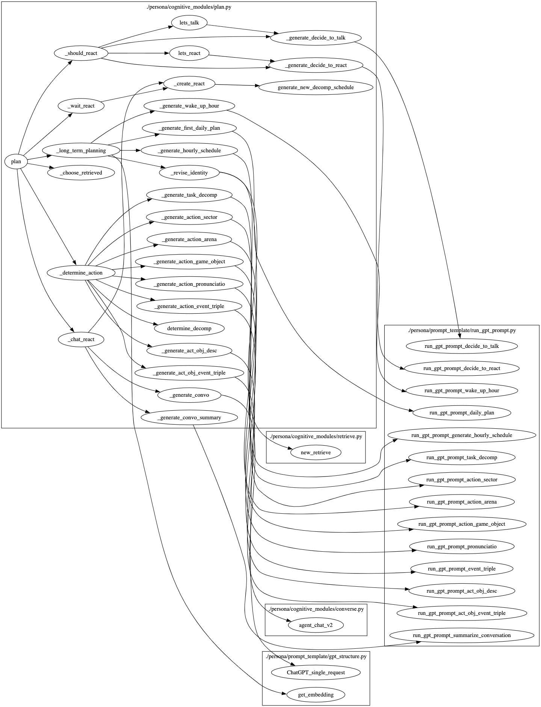

# Plan 模块

## 脚本功能概述

`plan.py` 脚本定义了生成型代理（generative agents）的 "Plan" 模块。该模块负责生成代理的日常计划，包括长短期计划，反应计划，以及与其他代理的互动计划。通过与 GPT-3 模型交互生成代理的每日活动计划，并基于代理的感知和检索到的信息进行相应的反应。

## 1. 核心类和方法

**Call Graph**

plan

- _long_term_planning
  - _generate_wake_up_hour
  - _generate_first_daily_plan
  - _revise_identity
  - _generate_hourly_schedule
- _determine_action
  - _determine_decomp
  - _generate_task_decomp: 任务分解
  - _generate_action_sector
  - _generate_action_arena
  - _generate_action_game_object
  - _generate_action_pronunciatio
  - _generate_action_event_triple
  - _generate_act_obj_desc
  - _generate_act_obj_event_triple

- _choose_retrieved

- _should_react
  - _lets_talk / _generate_decide_to_talk

  - _lets_react / _generate_decide_to_react

- _chat_react
  - _generate_convo

  - _generate_convo_summary

  - _create_react
    - _generate_new_decomp_schedule

- _wait_react
  - _create_react




| 函数名                           | 描述                                                         | 输入参数                                                     | 输出                                           |
| -------------------------------- | ------------------------------------------------------------ | ------------------------------------------------------------ | ---------------------------------------------- |
| `_generate_wake_up_hour`         | 生成角色的起床时间                                           | `persona`                                                    | 一个整数，表示角色的起床时间                   |
| `_generate_first_daily_plan`     | 生成角色的每日计划，返回当天的行动列表                       | `persona` ，<br />`wake_up_hour`                             | 一份每日行动列表                               |
| `_generate_hourly_schedule`      | 根据每日计划生成每小时的安排                                 | `persona` ，<br />`wake_up_hour`                             | 一个活动和其持续时间（分钟）列表               |
| `_generate_task_decomp`          | 分解给定的任务                                               | `persona` ，<br />`task` <br />`duration` (整数，任务持续时间) | 一个包含分解任务描述及其持续时间的列表         |
| `_generate_action_sector`        | 生成行动的区域                                               | `act_desp` (字符串，行动描述)，<br />`persona` ，<br />`maze` (Maze 类实例) | 一个字符串，表示行动的区域                     |
| `_generate_action_arena`         | 生成行动的竞技场                                             | `act_desp` (字符串，行动描述)，<br />`persona` ，<br />`maze` (Maze 类实例)，<br />`act_world` (字符串)，<br />`act_sector` (字符串) | 一个字符串，表示行动的竞技场                   |
| `_generate_action_game_object`   | 生成行动的游戏对象                                           | `act_desp` (字符串，行动描述)，<br />`act_address` (字符串，行动地址)，<br />`persona` ，<br />`maze` (Maze 类实例) | 一个字符串，表示行动的游戏对象                 |
| `_generate_action_pronunciatio`  | 生成行动的表情描述                                           | `act_desp` (字符串，行动描述)，<br />`persona`               | 一个字符串，表示行动的表情描述                 |
| `_generate_action_event_triple`  | 生成行动的事件三元组                                         | `act_desp` (字符串，行动描述)，<br />`persona`               | 一个字符串，表示行动的事件三元组               |
| `_generate_act_obj_desc`         | 生成行动对象的描述                                           | `act_game_object` (字符串)，<br />`act_desp` (字符串)，<br />`persona` | 一个字符串，表示行动对象的描述                 |
| `_generate_act_obj_event_triple` | 生成行动对象的事件三元组                                     | `act_game_object` (字符串)，<br />`act_obj_desc` (字符串)，<br />`persona` | 一个字符串，表示行动对象的事件三元组           |
| `_generate_convo`                | 生成对话                                                     | `maze` (Maze 类实例)，<br />`init_persona` ，<br />`target_persona` | 对话内容和对话长度                             |
| `_generate_convo_summary`        | 生成对话总结                                                 | `persona` ，<br />`convo` (对话内容)                         | 一个字符串，表示对话总结                       |
| `_generate_decide_to_talk`       | 决定是否进行对话                                             | `init_persona` ，<br />`target_persona` ，<br />`retrieved` (字典) | 一个布尔值，表示是否进行对话                   |
| `_generate_decide_to_react`      | 决定是否做出反应                                             | `init_persona` ，<br />`target_persona` ，<br />`retrieved` (字典) | 一个字符串，表示反应模式                       |
| `generate_new_decomp_schedule`   | 生成新的分解日程                                             | `persona` ，<br />`inserted_act` (字符串)，<br />`inserted_act_dur` (整数)，<br />`start_hour` (整数)，<br />`end_hour` (整数) | 一个新的日程列表                               |
| `_revise_identity`               | 修改角色的身份信息                                           | `persona`                                                    | 无                                             |
| `_long_term_planning`            | 制定角色的长期计划，如果是新的一天，则生成起床时间和小时计划 | `persona` ，<br />`new_day` (布尔值或字符串)                 | 无                                             |
| `_determine_action`              | 创建角色的下一个行动序列，并设置所有相关的行动变量           | `persona` ，<br />`maze` (Maze 类实例)                       | 无                                             |
| `_choose_retrieved`              | 从检索到的记忆中选择一个事件以进行反应                       | `persona` ，<br />`retrieved` (字典)                         | 一个字典，表示选择的事件                       |
| `_should_react`                  | 确定角色在给定的检索值下应如何反应                           | `persona` ，<br />`retrieved` (字典)，<br />`personas` (字典) | 一个字符串，表示反应模式，或者布尔值表示不反应 |
| `_create_react`                  | 创建新的反应并添加到角色的行动队列中                         | `persona` ，<br />`inserted_act` (字符串)，<br />`inserted_act_dur` (整数)，<br />`act_address` (字符串)，<br />`act_event` (元组)，<br />`chatting_with` (字符串)，<br />`chat` (对话内容)，<br />`chatting_with_buffer` (字典)，<br />`chatting_end_time` (时间)，<br />`act_pronunciatio` (字符串)，<br />`act_obj_description` (字符串)，<br />`act_obj_pronunciatio` (字符串)，<br />`act_obj_event` (元组)，<br />`act_start_time` (时间) | 无                                             |
| `_chat_react`                    | 处理聊天反应，并调用之前定义的函数生成对话和添加反应         | `maze` (Maze 类实例)，<br />`persona` ，<br />`focused_event` (字典)，<br />`reaction_mode` (字符串)，<br />`personas` (字典) | 无                                             |
| `_wait_react`                    | 处理等待反应，并调用之前定义的函数生成等待的反应             | `persona` ，<br />`reaction_mode` (字符串)                   | 无                                             |
| `plan`                           | 主要的认知函数，用于根据检索到的记忆和感知、迷宫以及初始状态来进行长期和短期的计划 | `persona` ，<br />`maze` (Maze 类实例)，<br />`personas` (字典)，<br />`new_day` (布尔值或字符串)，<br />`retrieved` (字典) | 一个字符串，表示目标行动地址                   |

### 1.1 生成相关的方法

#### 1.1.1 生成起床时间 `generate_wake_up_hour`

```python
def generate_wake_up_hour(persona):
    """
    生成代理的起床时间。

    输入：
      persona: 代理实例。

    输出：
      起床时间（小时）。
    """
```

- **功能**：生成代理的起床时间。
- **输入参数**：`persona` 当前代理实例。
- **输出**：返回代理的起床时间（小时）。

#### 1.1.2 生成每日计划 `generate_first_daily_plan`

```python
def generate_first_daily_plan(persona, wake_up_hour):
    """
    生成代理的每日计划。

    输入：
      persona: 代理实例。
      wake_up_hour: 起床时间。

    输出：
      每日计划列表。
    """
```

- **功能**：生成代理的每日计划。
- **输入参数**：
  - `persona`：当前代理实例。
  - `wake_up_hour`：起床时间。
- **输出**：返回每日计划列表。

#### 1.1.3 生成每小时计划 `generate_hourly_schedule`

```python
def generate_hourly_schedule(persona, wake_up_hour):
    """
    基于每日计划生成每小时的活动计划。

    输入：
      persona: 代理实例。
      wake_up_hour: 起床时间。

    输出：
      每小时计划列表。
    """
```

- **功能**：生成代理的每小时计划。
- **输入参数**：
  - `persona`：当前代理实例。
  - `wake_up_hour`：起床时间。
- **输出**：返回每小时计划列表。

#### 1.1.4 生成任务分解 `generate_task_decomp`

```python
def generate_task_decomp(persona, task, duration):
    """
    将任务分解为更小的子任务。

    输入：
      persona: 代理实例。
      task: 任务描述。
      duration: 任务持续时间。

    输出：
      子任务列表。
    """
```

- **功能**：将任务分解为更小的子任务。
- **输入参数**：
  - `persona`：当前代理实例。
  - `task`：任务描述。
  - `duration`：任务持续时间。
- **输出**：返回子任务列表。

#### 1.1.5 生成行动部门 `generate_action_sector`

```python
def generate_action_sector(act_desp, persona, maze):
    """
    根据任务描述生成行动部门。

    输入：
      act_desp: 任务描述。
      persona: 代理实例。
      maze: 当前迷宫实例。

    输出：
      行动部门。
    """
```

- **功能**：根据任务描述生成行动部门。
- **输入参数**：
  - `act_desp`：任务描述。
  - `persona`：当前代理实例。
  - `maze`：当前迷宫实例。
- **输出**：返回行动部门。

#### 1.1.6 生成行动场景 `generate_action_arena`

```python
def generate_action_arena(act_desp, persona, maze, act_world, act_sector):
    """
    根据任务描述生成行动场景。

    输入：
      act_desp: 任务描述。
      persona: 代理实例。
      maze: 当前迷宫实例。
      act_world: 行动世界。
      act_sector: 行动部门。

    输出：
      行动场景。
    """
```

- **功能**：根据任务描述生成行动场景。
- **输入参数**：
  - `act_desp`：任务描述。
  - `persona`：当前代理实例。
  - `maze`：当前迷宫实例。
  - `act_world`：行动世界。
  - `act_sector`：行动部门。
- **输出**：返回行动场景。

#### 1.1.7 生成行动对象 `generate_action_game_object`

```python
def generate_action_game_object(act_desp, act_address, persona, maze):
    """
    根据任务描述生成行动对象。

    输入：
      act_desp: 任务描述。
      act_address: 行动地址。
      persona: 代理实例。
      maze: 当前迷宫实例。

    输出：
      行动对象。
    """
```

- **功能**：根据任务描述生成行动对象。
- **输入参数**：
  - `act_desp`：任务描述。
  - `act_address`：行动地址。
  - `persona`：当前代理实例。
  - `maze`：当前迷宫实例。
- **输出**：返回行动对象。

#### 1.1.8 生成行动描述 `generate_act_obj_desc`

```python
def generate_act_obj_desc(act_game_object, act_desp, persona):
    """
    生成行动对象描述。

    输入：
      act_game_object: 行动对象。
      act_desp: 任务描述。
      persona: 代理实例。

    输出：
      行动对象描述。
    """
```

- **功能**：生成行动对象描述。
- **输入参数**：
  - `act_game_object`：行动对象。
  - `act_desp`：任务描述。
  - `persona`：当前代理实例。
- **输出**：返回行动对象描述。

### 1.2 计划模块方法

#### 1.2.1 计划主方法 `plan`

```python
def plan(persona, maze, personas, new_day, retrieved):
    """
    主计划方法，根据检索到的信息生成代理的短期和长期计划。

    输入：
      persona: 当前代理实例。
      maze: 当前迷宫实例。
      personas: 代理字典。
      new_day: 新的一天。
      retrieved: 检索到的记忆和感知信息。

    输出：
      目标行动地址。
    """
```

- **功能**：生成代理的短期和长期计划。
- **输入参数**：
  - `persona`：当前代理实例。
  - `maze`：当前迷宫实例。
  - `personas`：代理字典。
  - `new_day`：新的一天。
  - `retrieved`：检索到的记忆和感知信息。
- **输出**：返回目标行动地址。

#### 1.2.2 长期计划方法 `_long_term_planning`

```python
def _long_term_planning(persona, new_day):
    """
    为代理生成长期计划。

    输入：
      persona: 当前代理实例。
      new_day: 新的一天。

    输出：
      None
    """
```

- **功能**：为代理生成长期计划。
- **输入参数**：
  - `persona`：当前代理实例。
  - `new_day`：新的一天。

#### 1.2.3 短期计划方法 `_determine_action`

```python
def _determine_action(persona, maze):
    """
    生成代理的下一步行动计划。

    输入：
      persona: 当前代理实例。
      maze: 当前迷宫实例


    输出：
      None
    """
```

- **功能**：生成代理的下一步行动计划。
- **输入参数**：
  - `persona`：当前代理实例。
  - `maze`：当前迷宫实例。

## 2. 示例代码

```python
if __name__ == "__main__":
    from persona import Persona
    from maze import Maze

    persona = Persona("example_persona")
    maze = Maze()
    personas = {"example_persona": persona}

    new_day = "First day"
    retrieved = {}  # 示例的检索数据

    plan(persona, maze, personas, new_day, retrieved)
```


## 4. 总结

`plan.py` 脚本定义了生成型代理的计划模块，通过生成每日活动计划和反应计划，使代理能够在虚拟世界中智能地进行长短期决策和行动。该模块与 GPT-3 模型交互生成计划，并根据代理的感知和检索信息调整计划，从而提升代理的智能性和适应性。
